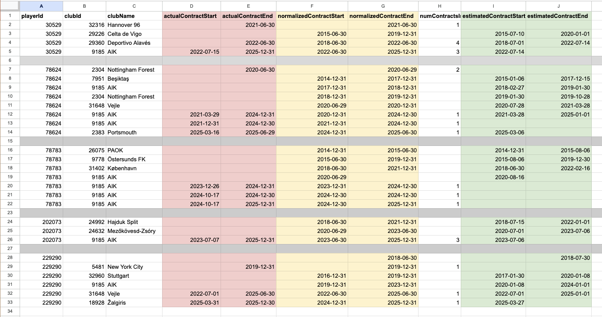

# Contract Estimation from Transfers

## Task
> "Ändra i databsen så att alla spelare som har lämnat som bosman har utgående kontrakt samt att alla spelare som lämnar som unknown transfer fee eller för given transferfee får ett estimerat kontrakt på minst 18 månader"

## Plan
- om transfer har transfer fee: sätt det tidigare kontraktets slutdatum till transferdatum + 18 månader, och nytt kontrakt börjar här
- om free transfer: sätt det tidigare kontraktets slutdatum till detta transferdatum, och nytt kontrakt börjar här
- om transfer var lån: ignorera
- om transfern var till without club: sätt detta som tidigare kontraktets slutdatum
- om transfern var från without club: nytt kontrakt börjar här

## Steg
1. städa de faktiska kontrakten (merga ihop dubletter)
2. bygga estimerade "kontrakt" från transfers
3. utgå från faktiska kontrakt, om kontraktet saknar start eller slut - leta efter estimerat kontrakt med matchande start eller slut (det vi har) för samma klubb id, använd i så fall dens värde för start eller slut (om finns)
4. gå igenom estimerade kontrakt - om det inte redan finns ett riktigt kontrakt för tidsperiod och klubbid, lägg in det estimerade

## To Do?
- Max längd på kontrakt (4-5 år) - om längre efter merge, dela upp så att det istället ser ut som förlängningar
- Om Free Transfer - sätt tidigare kontraktsslut till detta fromseasonid end (jag upptäckte lite mismatch här och fortsatte inte)
- Flagga tydligt vad som är estimerat och inte
- Skottår - bättre normalisera datum
- Steg 1 och steg 2: skapa preliminära tables (?)
- Bryt ut datum normalize metoden (beror på hur  datum / säsong ska användas?)

 
